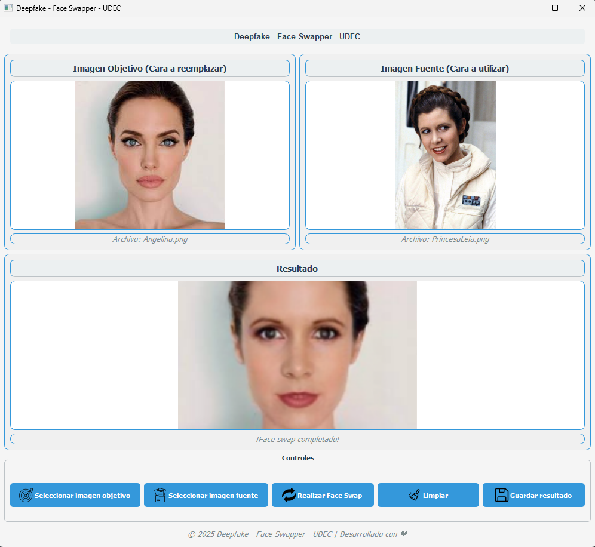

# Deepfake - Face Swapper - UDEC

Deepfake - Face Swapper - UDEC es una aplicación de escritorio con interfaz gráfica (PyQt5) que permite intercambiar rostros entre dos imágenes usando modelos de inteligencia artificial (InsightFace).

## Características
- Interfaz gráfica moderna y fácil de usar.
- Selección de imagen objetivo y fuente desde tu equipo.
- Generación automática de imágenes combinadas en una carpeta dedicada.
- Organización automática de imágenes seleccionadas y generadas.
- Progreso visual y notificaciones de éxito/error.

## Estructura del proyecto
```
LastDeepFake/
├── core/                  # Lógica de procesamiento (face_swapper.py)
├── gui/                   # Interfaz gráfica (main_window.py)
├── imagenes/
│   ├── seleccionadas/     # Imágenes que puedes usar como fuente u objetivo
│   └── generadas/         # Resultados de los face swaps
├── models/                # Modelos ONNX (NO SE INCLUYEN EN EL REPO)
├── main.py                # Punto de entrada de la app
├── requirements.txt       # Dependencias
└── README.md
```

## Instalación
1. Clona este repositorio:
   ```
   git clone <url-del-repo>
   ```
2. Instala las dependencias:
   ```
   pip install -r requirements.txt
   ```
3. Descarga un modelo ONNX compatible para face swapping y colócalo en la carpeta `models/`.
   - **Nota:** El modelo necesario para el face swapping no se distribuye por motivos de licencia y derechos. Consulta la documentación oficial de InsightFace o de otros proyectos compatibles para obtener un modelo ONNX adecuado.

## Uso
1. Ejecuta la aplicación:
   ```
   python main.py
   ```
2. Selecciona una imagen objetivo y una fuente desde la interfaz.
3. Haz clic en "Realizar Face Swap" y espera el resultado.
4. Las imágenes generadas se guardarán automáticamente en `imagenes/generadas/`.

## Ejemplo de resultado

A continuación se muestra un ejemplo de la interfaz y el resultado generado por la aplicación:



---

## Configuración del modelo
La ruta al modelo ONNX de face swapper es genérica por defecto (`models/face_swapper_model.onnx`). Debes cambiarla por la ruta y el nombre del modelo ONNX que vayas a utilizar en tu entorno. Puedes configurarlo al crear la instancia de `FaceSwapper` o modificando el parámetro `model_path` en el código.

---

## Notas legales y de licencia
- Este proyecto utiliza modelos de terceros (por ejemplo, InsightFace) bajo licencia MIT, pero **no incluye ningún modelo ONNX** por respeto a la distribución original y derechos del autor.
- No subas modelos ni imágenes privadas al repositorio.
- Consulta la licencia de InsightFace, de los modelos y de cualquier recurso utilizado antes de redistribuir.

## .gitignore recomendado
```
imagenes/seleccionadas/
imagenes/generadas/
models/
```

## Créditos
- Basado en InsightFace: https://github.com/deepinsight/insightface
